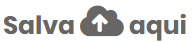
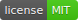
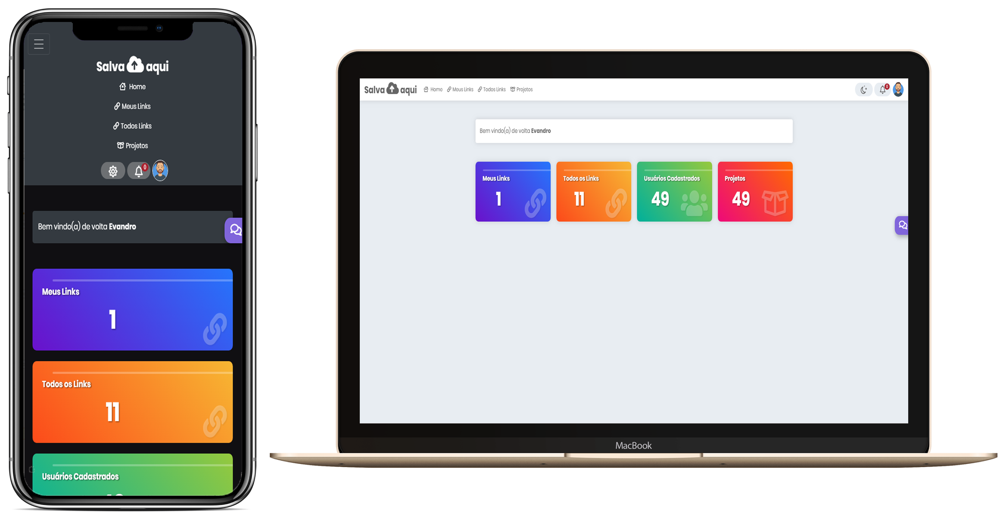

<h1 align="center">
    
</h1>

<h4 align="center">
  🚀 SalvaAqui v1
</h4>

  

  <a href="#rocket-tecnologias">Tecnologias</a>&nbsp;&nbsp;&nbsp;|&nbsp;&nbsp;&nbsp;
  <a href="#-projeto">Projeto</a>&nbsp;&nbsp;&nbsp;|&nbsp;&nbsp;&nbsp;
  <a href="#-como-contribuir">Como contribuir</a>&nbsp;&nbsp;&nbsp;|&nbsp;&nbsp;&nbsp;
  <a href="#memo-licença">Licença</a>

 

  

## :rocket: Tecnologias

Esse projeto foi desenvolvido com as seguintes tecnologias:

- [Node.js](https://nodejs.org/en/)
- [EJS](https://ejs.co/)
- [Bootstrap Native](https://getbootstrap.com/)
- [JQuery](https://jquery.com/)

## 💻 Meu Primeiro Projeto

O SalvaAqui é um projeto que simples que serve para você salvar links ou textos importantes em um lugar seguro e também compartilhar esse tipo de conteúdo.

## 🤔 Como contribuir

- Adicionar verificação por email;
- Terminar a parte para controle de projetos;
- Adicionar novas funcionalidades`;

## :memo: Licença

Esse projeto está sob a licença MIT. Veja o arquivo [LICENSE](LICENSE.md) para mais detalhes.

---

Feito com ♥ by Evandro Pinheiro :wave: [Contato!](e_sayto@hotmail.com)
